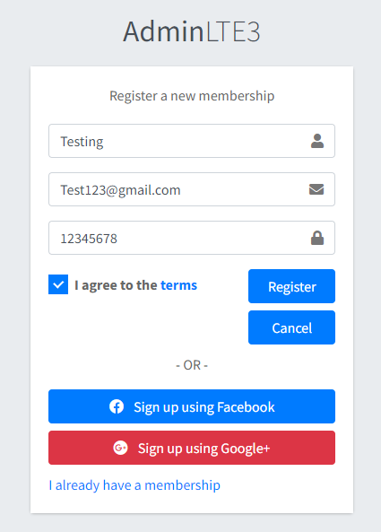
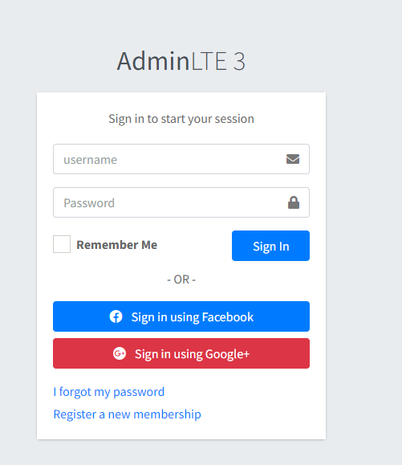
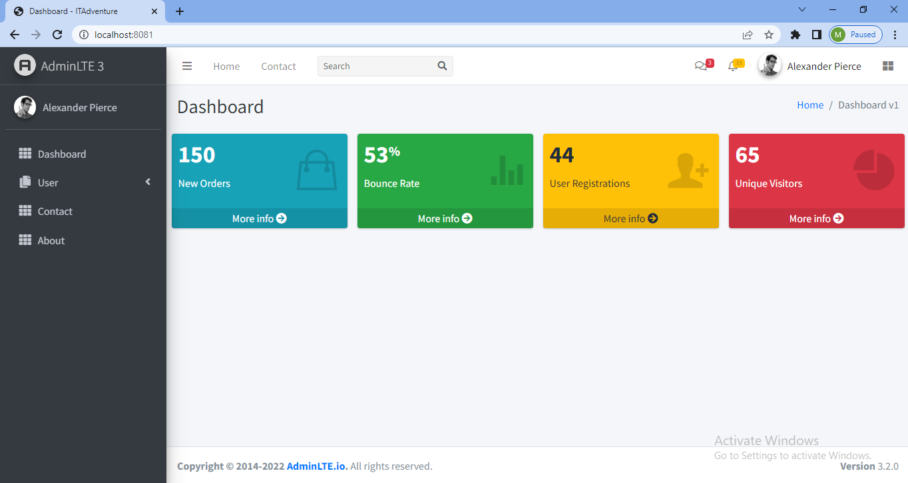
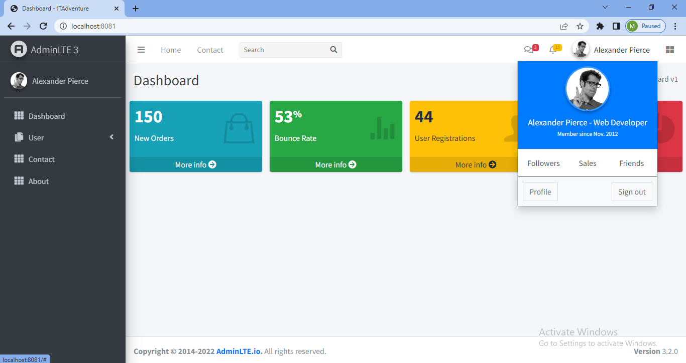
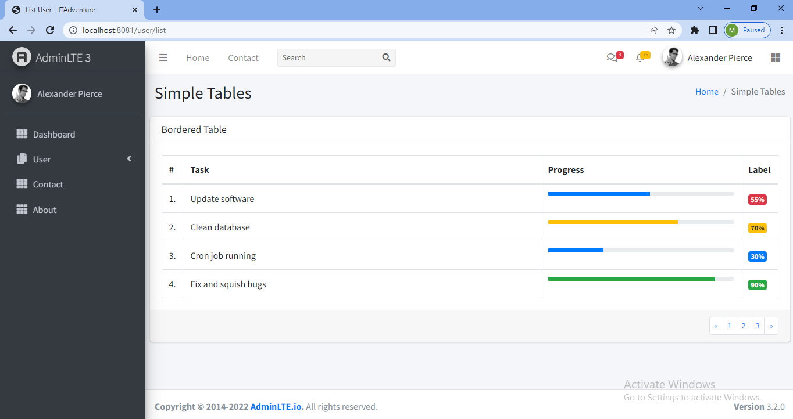
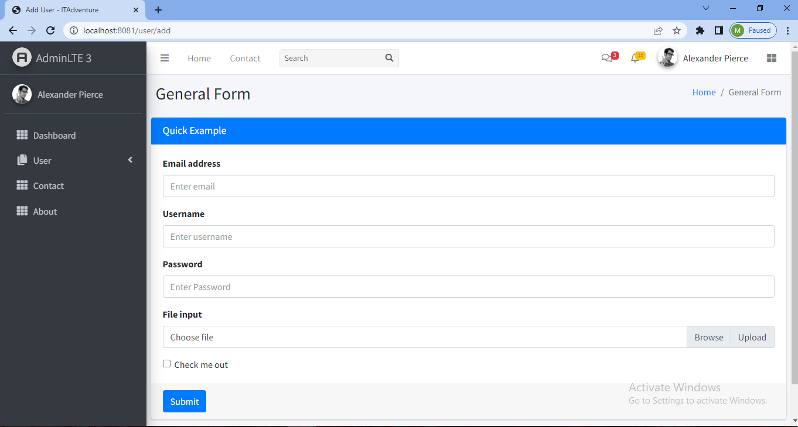

# springboot-adminlte3-template

### Things todo list:

1. Clone from this repository: `git clone https://github.com/hendisantika/springboot-adminlte3-template.git`
2. Navigate to the folder: `cd springboot-adminlte3-template`
3. Run the application: `mvn clean spring-boot:run`
4. Open your favorite browser: http://localhost:8080 (port can be edited as you see fit)

#### Images Screen shot

Register Page

Login Page

Dashboard Page

Profile Page

User List Page

User Add Page

